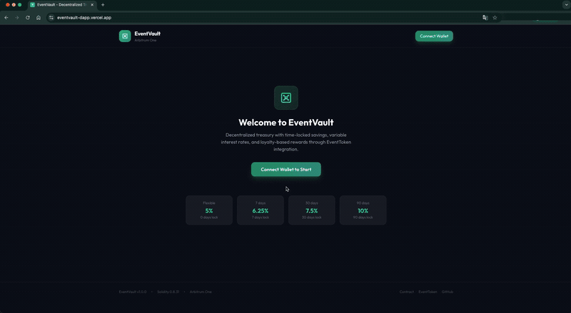

# 🏦 EventVault - Decentralized Treasury DApp

**EventVault** is a **full-stack blockchain** solution for decentralized savings with time-locked deposits and loyalty rewards. It combines a **Solidity smart contract** with an interactive **React frontend** and a **comprehensive Foundry test suite**, allowing users to **deposit ETH, choose lock periods, earn variable interest, and benefit from tier-based discounts** — all deployed on **Arbitrum One mainnet**.

[](https://soliditylang.org/)
[](https://book.getfoundry.sh/)
[](https://react.dev/)
[](https://typescriptlang.org/)
[](https://arbiscan.io/address/0x2ED519F7Dc7f8e2761b2aA0B52e0199b713D8863)
[](https://github.com/dgordillodc/EventVault/actions)
[](LICENSE)

## ✨ Key Features

- 💰 Deposit ETH with flexible or time-locked periods (7/30/90 days)
- 📈 Variable interest rates from 5% to 10% APY based on lock duration
- 🏆 Loyalty tier system: Bronze → Silver → Gold → Platinum
- 💸 Fee discounts up to 75% for EventToken (EVTK) holders
- 🔐 Emergency withdraw option with penalty
- 📊 Real-time on-chain balance and interest tracking
- 🧪 **100 Foundry tests** (unit + fuzz) with **100% coverage** across all metrics
- 🔗 Multi-wallet support: MetaMask, WalletConnect, Coinbase
- 🎨 Clean and responsive UI with real-time updates

## 🔥 Live Demo

👉 [https://eventvault-dapp.vercel.app](https://eventvault-dapp.vercel.app)

<div align="center">
  <a href="https://eventvault-dapp.vercel.app" target="_blank">
    
  </a>
</div>

## 📍 Deployed Contracts (Arbitrum One Mainnet)

| Contract | Address | Explorer |
|----------|---------|----------|
| EventVault | `0x2ED519F7Dc7f8e2761b2aA0B52e0199b713D8863` | [Arbiscan](https://arbiscan.io/address/0x2ED519F7Dc7f8e2761b2aA0B52e0199b713D8863) |
| EventToken | `0x030ae3125a9cdAD35B933D4f92CccdE78934A778` | [Arbiscan](https://arbiscan.io/address/0x030ae3125a9cdAD35B933D4f92CccdE78934A778) |

> **Note**: Deployed on mainnet with real funds capability

## 🛠️ Tech Stack

- **Smart Contract**: Solidity 0.8.31 + OpenZeppelin
- **Testing**: Foundry (forge test, fuzz, coverage)
- **Blockchain**: Arbitrum One (Mainnet)
- **Frontend**: React 19 + TypeScript + Vite
- **Styling**: TailwindCSS
- **Web3 Stack**:
  - wagmi v2 + viem (Contract interaction)
  - Reown AppKit (Multi-wallet connection)
- **CI/CD**: GitHub Actions
- **Deployment**:
  - Smart Contract: Remix IDE → [Arbiscan](https://arbiscan.io/address/0x2ED519F7Dc7f8e2761b2aA0B52e0199b713D8863)
  - Frontend: [Vercel](https://eventvault-dapp.vercel.app)

## 🧪 Foundry Testing

Professional-grade test suite with **unit tests**, **fuzz tests**, **mock contracts**, and **system invariant checks**.

### Test Architecture

```
test/
├── EventVault.t.sol          # 88 unit tests across 13 categories
├── EventVault.fuzz.t.sol     # 12 fuzz tests with bound(), assume(), invariants
└── mocks/
    └── MockEventToken.sol    # Mock for EventToken + RejectETH for transfer failures
```

### Test Categories

| Category | Tests | Techniques |
|----------|-------|------------|
| Constructor & State | 3 | Custom error selectors |
| Deposit (all lock periods) | 12 | vm.deal, vm.prank, vm.expectEmit |
| Withdrawal (normal/locked) | 10 | vm.warp, custom error params, daily limit = 0 |
| Emergency Withdrawal | 7 | Penalty calculation, state reset, RejectETH mock |
| Interest Accrual | 9 | vm.warp (365 days), same-block, zero-balance accrual |
| Internal Transfers | 7 | Balance conservation, account activation |
| Admin Functions | 12 | onlyOwner, config updates, fee collection, setEventToken |
| Security & Access Control | 9 | Blacklist, pause, role checks, Frozen status (vm.store) |
| EventToken Integration | 6 | MockEventToken, tier discounts, try/catch, revert handling |
| Receive & Fallback | 2 | Low-level call, abi.encodeWithSignature |
| View Functions & History | 5 | Transaction recording, isLocked, pending interest edges |
| Coverage Completion | 6 | vm.store (storage manipulation), vm.load, edge cases |

### Fuzz Testing

| Fuzz Test | Parameters | Property Verified |
|-----------|------------|-------------------|
| Deposit balance | amount (1 wei–10 ETH) | Balance always equals deposited |
| Deposit overflow | amount (>10 ETH) | Always reverts |
| Lock periods | lockType (0–3) | Unlock time matches enum |
| Withdrawal net | deposit + withdraw | Net = amount − 1% fee |
| Interest over time | timeElapsed (1d–2y) | Interest proportional to time |
| Long vs Flexible | timeElapsed | Long always > Flexible |
| Lock boundary | before + after | Before reverts, after succeeds |
| Emergency penalty | amount + time | Penalty only when locked |
| Transfer conservation | deposit + transfer | Sum of balances conserved |
| Full lifecycle | amount + lock + time | Deposit → wait → withdraw |

### Advanced Techniques

| Technique | Usage |
|-----------|-------|
| **3 ENUMs** | AccountStatus, LockPeriod, TransactionType |
| **10 Custom Errors** | With parameters (current, requested, max) |
| **MockEventToken** | Simulates tier discounts and loyalty levels |
| **RejectETH** | Contract without receive() for transfer failure tests |
| **vm.warp** | Time manipulation for locks and interest accrual |
| **vm.deal** | Fund accounts with precise amounts |
| **vm.expectEmit** | Verify 9 different event types |
| **bound() + assume()** | Constrain fuzz inputs efficiently |
| **assertApproxEqAbs** | Interest rounding tolerance |
| **System Invariants** | _checkInvariants() after fuzz operations |
| **Deploy Script** | Foundry script for Arbitrum deployment |
| **CI/CD** | GitHub Actions automated pipeline |

### Run Tests

```bash
# Install Foundry
curl -L https://foundry.paradigm.xyz | bash
foundryup

# Clone and enter the project
git clone https://github.com/dgordillodc/EventVault.git
cd EventVault

# Install dependencies
forge install

# Run all tests
forge test -vvv

# Run with gas report
forge test --gas-report

# Run coverage
forge coverage

# Run only fuzz tests
forge test --match-contract Fuzz -vvv
```

### Test Results

```
Ran 2 test suites: 100 tests passed, 0 failed, 0 skipped (100 total tests)
```

### Coverage Report

| File | Lines | Statements | Branches | Functions |
|------|-------|------------|----------|-----------|
| EventVault.sol | 100.00% (210/210) | 100.00% (235/235) | 100.00% (41/41) | 100.00% (35/35) |
| MockEventToken.sol | 100.00% (12/12) | 100.00% (7/7) | 100.00% (4/4) | 100.00% (5/5) |

> ✅ **100% coverage across all metrics** — Lines, Statements, Branches, and Functions

## 💰 Interest Rates & Tiers

| Lock Period | Duration | APY | Multiplier |
|-------------|----------|-----|------------|
| 🔓 Flexible | No lock | 5.00% | 1.00x |
| ⏰ Short | 7 days | 6.25% | 1.25x |
| 📅 Medium | 30 days | 7.50% | 1.50x |
| 🔐 Long | 90 days | 10.00% | 2.00x |

| Tier | EVTK Required | Fee Discount | Interest Bonus |
|------|---------------|--------------|----------------|
| 🥉 Bronze | 0 | 0% | 0% |
| 🥈 Silver | 100+ | 25% | 5% |
| 🥇 Gold | 500+ | 50% | 10% |
| 💎 Platinum | 1000+ | 75% | 15% |

## 🚀 How to Use

### Quick Start
1. Open [eventvault-dapp.vercel.app](https://eventvault-dapp.vercel.app)
2. Click **"Connect Wallet"** (MetaMask, WalletConnect, or Coinbase)
3. Switch to **Arbitrum One** network
4. Test core functions:
   - Deposit ETH with your preferred lock period
   - Track real-time interest accumulation
   - Claim interest or withdraw funds

### Run Locally
```bash
git clone https://github.com/dgordillodc/EventVault.git
cd EventVault/frontend
npm install
npm run dev
```

## 📐 Project Structure

```
EventVault/
├── contracts/                  # Smart contracts (Solidity)
│   ├── EventVault.sol          # Main vault contract (742 lines)
│   └── interfaces/
│       └── IEventToken.sol     # EventToken interface
├── test/                       # Foundry test suite
│   ├── EventVault.t.sol        # Unit tests (88 tests)
│   ├── EventVault.fuzz.t.sol   # Fuzz tests (12 tests)
│   └── mocks/
│       └── MockEventToken.sol  # Mock contracts
├── script/
│   └── DeployEventVault.s.sol  # Foundry deploy script
├── frontend/                   # React DApp
│   ├── src/
│   │   ├── components/         # UI components
│   │   ├── hooks/              # Custom hooks (useEventVault)
│   │   └── lib/                # Config, ABI, utils
│   └── package.json
├── .github/workflows/test.yml  # CI/CD pipeline
├── foundry.toml                # Foundry configuration
├── TESTING_GUIDE.md            # Manual test results (Remix IDE)
└── README.md
```

## 🔗 Event Ecosystem

EventVault is part of a complete decentralized event management platform:

| Project | Description | Link |
|---------|-------------|------|
| **EventTicketHub** | Event creation and ticket sales | [GitHub](https://github.com/dgordillodc/EventTicketHub) |
| **EventToken** | ERC-20 loyalty token with staking | [GitHub](https://github.com/dgordillodc/EventToken) |
| **EventMarketplace** | Secondary ticket marketplace | [GitHub](https://github.com/dgordillodc/EventMarketplace) |
| **EventVault** | Decentralized treasury | This repo |

## 🔒 Security

- CEI Pattern for reentrancy protection
- Custom errors for gas-efficient reverts
- Pausable operations for emergencies
- Blacklist for malicious addresses
- Daily withdrawal limits
- Time-lock enforcement
- Mock contract testing for edge cases

## 📜 License

This project is licensed under **LGPL-3.0-only**.

---

## 👨‍💻 Author

**David Gordillo**

[](https://github.com/dgordillodc)
[](https://www.linkedin.com/in/david-gordillo-del-caño-6321031ab)
